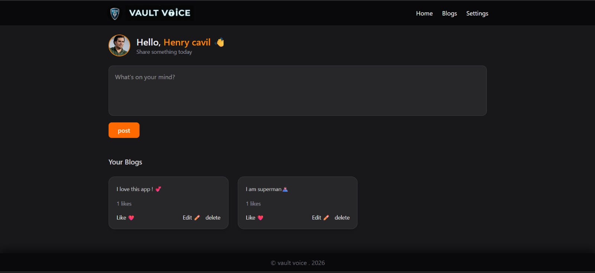

# 🔐 Voice Vault — Secure Blog Platform


---

## 🧠 About the Project

**Voice Vault** is a secure full-stack blogging platform designed to give users a **private and safe space to express their thoughts**.

The application focuses on **authentication, data security, and user isolation**, ensuring that each user can access and manage only their own content.

Built with a clean architecture and modern UI, it reflects real-world full-stack development practices.

---

## 🖼️ Preview

* 🔧 Interactive tools panel for quick actions
* 🧑‍💻 Personalized dashboard with user-specific posts
* ❤️ Like system for engagement
* 📸 Profile image upload functionality



---

## 🚀 Key Features

* 🔐 **Secure Authentication**

  * User signup and login with bcrypt password hashing
  * JWT-based authentication for secure sessions

* 🛡️ **Protected Experience**

  * Only authenticated users can access core features
  * Complete user data isolation

* ✍️ **Blogging System**

  * Create, view, and delete posts
  * Personalized content feed

* ❤️ **Engagement System**

  * Like and unlike posts

* 🧑‍💼 **User Profiles**

  * Custom profile management
  * Profile image upload using multer

* 🔧 **Quick Actions Panel**

  * Tools icon for fast access to key features

* 📱 **Responsive UI**

  * Clean and modern design using Tailwind CSS

---

## 🌟 Key Highlights

* 🔐 Authentication & authorization using JWT
* 🛡️ Strong focus on security and user privacy
* ⚡ Structured backend using MVC architecture
* 📸 File upload handling with multer
* 🎯 Clean UI with smooth user experience

---

## 🛠️ Tech Stack

### Backend

* Node.js
* Express.js
* MongoDB + Mongoose
* bcrypt
* JSON Web Tokens (JWT)

### Frontend

* EJS (Server-side rendering)
* Tailwind CSS
* HTML5 & CSS3

### Tools

* Nodemon
* Tailwind CLI
* Concurrently

---

## 📂 Project Structure

```bash
secure-blog-platform/
├── config/
├── controllers/
├── middlewares/
├── models/
├── routes/
├── public/
├── views/
├── utils/
├── app.js
├── server.js
└── package.json
```

---

## 🔗 Links

* 💻 GitHub Repository:
  https://github.com/hafeez-07/secure-blog-platform


---

## 📦 Installation

```bash
git clone https://github.com/hafeez-07/secure-blog-platform.git
cd secure-blog-platform
npm install
```

### Environment Variables

Create a `.env` file:

```env
PORT=3000
MONGODB_URI=your_mongodb_connection_string
SESSION_SECRET=your_session_secret_key
JWT_SECRET=your_jwt_secret_key
```

### Run the App

```bash
npm run dev
```

👉 App runs at: http://localhost:3000

---

## 🔐 Security Features

* Password hashing with bcrypt
* JWT-based authentication
* Protected routes using middleware
* Secure session handling
* Input validation

---

## 🧠 What I Learned

* Implementing secure authentication systems using JWT
* Structuring scalable backend architecture (MVC pattern)
* Handling file uploads with multer
* Managing user-specific data securely
* Building a full-stack application with real-world practices

---

## 📄 License

This project is licensed under the ISC License.

---

## 🤝 Contributing

Contributions are welcome! Feel free to submit a pull request.

---

## 👤 Author

**Hafeez Mohammad**
GitHub: https://github.com/hafeez-07

---

**🚀 Built with a focus on security, scalability, and real-world development.**
